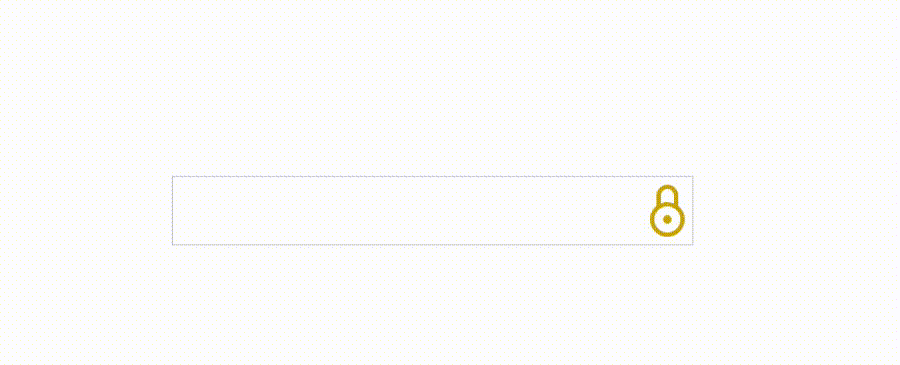

# Numericode decipher


### Brief
A Cipher maps a number to a letter e.g. where A = 1, B = 2, ..., Y = 25, Z = 26. Numericode is very similar to the numeric substitution cipher, except that the numbers given can be larger than 26 (the number of letters in the alphabet). If a number is 27 or larger, it needs to be divided by 27 until it is 26 or less. To give an example, 8 5 12 12 15 is a valid encoding of HELLO , but so is 216 3645 12 324 405 (because it is 8*27 5*27*27 12 12*27 15*27 ).  If a number is not an integer after being divided by 27, it should be presented as a space. For example, the message FOO BAR can be encoded as 6 15 15 28 2 1 18 (because 28 / 27 is not an integer, it is shown as a space).

### Prerequisites

You need to have Node, [yarn](https://yarnpkg.com/en/docs/install), [Docker](https://www.docker.com/) and [docker-compose](https://docs.docker.com/compose/install/) installed

### Commands

In root directory type `docker-compose up -d` to run the redis db container in the baclground. Later on to stop the container type `docker ps` and copy the ID and then `docker stop <ID>`
To run the web api go into the api folder and type
```bash
yarn
yarn start
```
Web api now running on port 8080.
To run tests just type in `yarn test`. Make sure the redis docker container is running whilst running the test

To run app go back into the app folder and type
```bash
yarn
yarn start
```
App now running on port 3000
